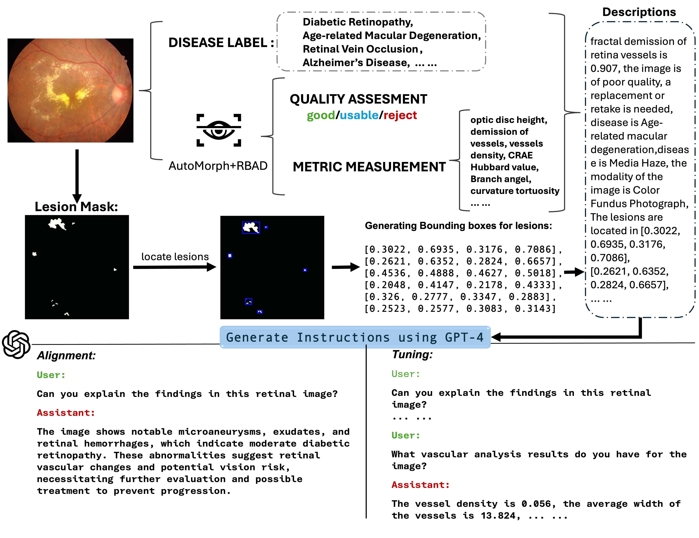
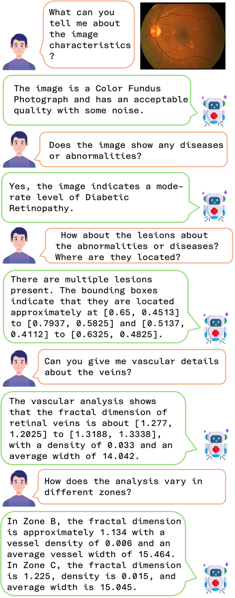

# RetinalGPT

RetinalGPT is a retinal multimodal assistant built on large vision-language models.

This repository contains the **data construction pipeline** used to build retinal instruction-following conversations for the paper:

- [RetinalGPT: A Retinal Clinical Preference Conversational Assistant Powered by Large Vision-Language Models](https://arxiv.org/pdf/2503.03987)
- [Hugging Face Model](https://huggingface.co/ASU-GSL/RetinalGPT)

## Overview

The main workflow in this repo is:

1. Build dataset-specific retinal descriptions through `Desc` classes.
2. Construct two types of data:
   - `instruction`
   - `alignment`
3. Run the pipeline in one of two modes:
   - `direct` generation
   - `batch` request packaging / unpacking
4. Convert generated outputs into instruction-tuning JSONL / JSON files.

This repo is **not** the full end-to-end training codebase for the entire project. It focuses on the retinal data processing and conversation generation pipeline.

<p align="center">
  
</p>

## Environment

The environment follows the **LLaVA base setup used for legacy `v0` workflows** in our project.

In practice, we use the standard LLaVA-style base environment and then install the extra packages needed by this repository:

```bash
conda create -n retinalgpt python=3.10 -y
conda activate retinalgpt
pip install --upgrade pip
pip install -r requirements.txt
```

If you already have a working LLaVA / `llava-v0` style environment, you can usually reuse it directly. For more details on the upstream base setup, please refer to the official LLaVA repository.

## Repository Structure

```text
RetinalGPT/
├── Instruction/
│   ├── Desc/                         # Dataset-specific description builders
│   ├── configs/                      # Config-driven dataset jobs
│   ├── experiments/                  # Optional script-style experiment entrypoints
│   ├── sample/                       # Minimal bring-your-own-data example
│   ├── tools/                        # Bounding box and postprocess helpers
│   ├── pipeline_runner.py            # Config-driven instruction/alignment runner
│   ├── batch_runner.py               # Config-driven batch runner
│   ├── pipeline_prompts.py           # Centralized instruction/alignment prompts
│   ├── batch_prompts.py              # Centralized batch prompts
│   ├── instruction_gen_async.py      # API-based conversation generation
│   ├── convert2json.py               # Output parsing / JSON conversion
│   ├── utils.py                      # Shared helper functions
│   └── ...
├── figures/                          # Paper assets and reference figures
├── requirements.txt
└── README.md
```

## Core Idea

Each dataset is wrapped by a description class in `Instruction/Desc`. These classes map raw metadata into a unified text description that can be consumed by a large multimodal model.

Typical inputs include:

- image quality predictions
- fractal / vascular quantitative features
- disease labels
- lesion masks or bounding boxes
- dataset-specific metadata

The generated description is then appended with task-specific prompt instructions and sent to the API to produce a retinal conversation sample.

## Main Components

### 1. Description Builders

`Instruction/Desc` contains dataset-specific classes such as:

- `APTOSDesc`
- `EyeQDesc`
- `IDRIDDesc`
- `MICCAIDesc`
- `MessidorDesc`
- `ODIRDDesc`
- `RFMiDDesc`
- `UKDesc`

All of them follow the same design goal: turn heterogeneous dataset annotations into a reusable natural-language description.

### 2. Data Targets

The project maintains two data tracks:

- `instruction`: multi-turn retinal conversations
- `alignment`: compact alignment-style supervision, usually one-turn

### 3. Execution Modes

The project maintains two execution modes:

- `direct`: call the API directly and write conversation outputs
- `batch`: package local requests first, send them to the API server, then unpack returned outputs

Most users only need `pipeline_runner.py`, `batch_runner.py`, and `Instruction/sample/`. `Instruction/experiments/` keeps the older script-style entrypoints in one place.

### 4. Conversation Generation

The main generation logic lives in:

- `Instruction/instruction_gen_async.py`

This module supports:

- async API calls
- text-only generation
- image-conditioned generation
- compatibility with older script-style calls already present in this repo

### 5. Structured Pipeline Entry

For `instruction` / `alignment` construction, the main entrypoint is:

- `Instruction/pipeline_runner.py`

For local batch request packaging and unpacking, the main entrypoint is:

- `Instruction/batch_runner.py`

Both are config-driven and use dataset jobs defined in `Instruction/configs/`.

## Quick Start

### Run RetinalGPT inference

For the simplest single-image run:

```bash
python3 run_retinalGPT_simple.py \
  --model-name ASU-GSL/RetinalGPT \
  --image-file /path/to/retinal_image.png \
  --question "Please describe this retinal image in detail."
```

After downloading the RetinalGPT weights, you can run inference directly with:

```bash
python3 run_retinalGPT.py \
  --model-name ASU-GSL/RetinalGPT \
  --image-folder /path/to/images \
  --question-file examples/inference/questions.json \
  --answers-file /path/to/predictions.jsonl
```

You can also run batch inference with a JSON or JSONL question file:

```bash
python3 run_retinalGPT.py \
  --model-name ASU-GSL/RetinalGPT \
  --image-folder /path/to/images \
  --question-file /path/to/questions.jsonl \
  --answers-file /path/to/predictions.jsonl
```

Supported batch input fields are:

- `id`
- `image` or `images`
- `question`
- `questions`
- `messages`

For `messages`, the script automatically extracts user or human turns as questions.

A minimal example question file is provided at [examples/inference/questions.json](./examples/inference/questions.json).

### Run an instruction/alignment job

```bash
cd Instruction

python3 pipeline_runner.py UK_instruction_direct
```

### Run a batch packaging job

```bash
cd Instruction

python3 batch_runner.py APTOS
```

### Run the custom-data sample

```bash
cd Instruction

python3 sample/generate_instruction_conversations.py \
  --metadata-csv sample/metadata_template.csv \
  --image-dir /path/to/your/images \
  --output-jsonl sample/generated_instruction_conversations.jsonl
```

For the minimal custom-data walkthrough, see [Instruction/sample/README.md](./Instruction/sample/README.md).

### Run an experiment-style entry script

```bash
cd Instruction

python3 experiments/instruction/ins_UK.py
python3 experiments/batch/batch_file_APTOS.py
```

### Output

The pipeline writes conversation samples into JSONL files with fields such as:

- `id`
- `image`
- `conversations`

These outputs can then be merged, cleaned, aligned, or converted into nested JSON using the helper scripts already included in `Instruction/`.

## Typical Flow

The intended engineering flow is now:

1. Build hidden metadata with `Desc/*`
2. Choose a dataset job from `Instruction/configs/`
3. Run either:
   - `pipeline_runner.py` for `instruction` / `alignment`
   - `batch_runner.py` for batch request workflows
4. Use `convert2json.py`, `utils.py`, and `Instruction/tools/` for packing, unpacking, conversion, and utility workflows
5. Use `Instruction/sample/` as the minimal bring-your-own-data example
6. Use `Instruction/experiments/` only if you want the old script-style entrypoints

## Notes

- This repository is intended for **research and data construction**.
- It is centered on retinal conversation generation and instruction data preparation.
- `Instruction/sample` is the recommended starting point for adapting the pipeline to a new dataset.
- `Instruction/experiments` keeps the dataset-specific experiment scripts out of the main pipeline path.
- Parts of the repository structure and code organization were optimized with OpenAI Codex under the authors' supervision.

## Citation

If you find this project useful, please cite:

```bibtex
@article{zhu2025retinalgpt,
  title={Retinalgpt: A retinal clinical preference conversational assistant powered by large vision-language models},
  author={Zhu, Wenhui and Li, Xin and Chen, Xiwen and Qiu, Peijie and Vasa, Vamsi Krishna and Dong, Xuanzhao and Chen, Yanxi and Lepore, Natasha and Dumitrascu, Oana and Su, Yi and others},
  journal={arXiv preprint arXiv:2503.03987},
  year={2025}
}
```

## Acknowledgement

We thank the LLaVA and LLaVA-Med projects. Our training and evaluation code is built on top of their open-source vision-language modeling framework.

<p align="center">
  
</p>
