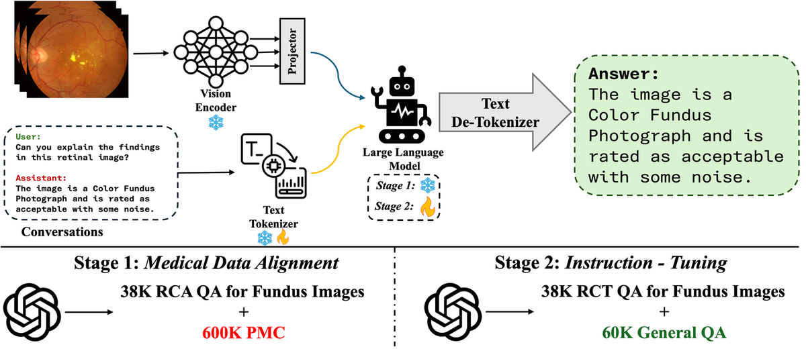
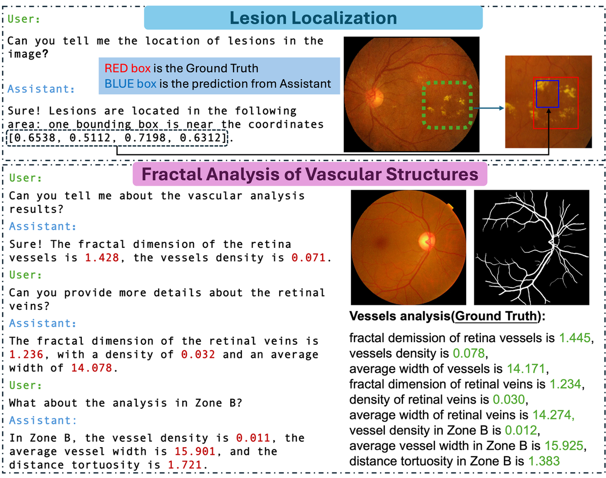

# RetinalGPT
Code for paper: RetinalGPT: A Retinal Clinical Preference Conversational Assistant Powered by Large Vision-Language Models
[Paper (arXiv)](https://arxiv.org/pdf/2503.03987)
[Model (Hugging Face)](https://huggingface.co/ASU-GSL/RetinalGPT)

## Figures

### Overall Training Strategy


### Chat Example


### Local Fractal Analysis


## Data Pipeline (Desc -> API -> Conversations)

This repository contains the data processing pipeline for instruction data generation.

Structured entrypoint:

- `Instruction/run_conversation_pipeline.py`

Core modules:

- `Instruction/Desc`
- `Instruction/instruction_gen_async.py`
- `Instruction/pipeline`

Example:

```bash
cd Instruction
python3 run_conversation_pipeline.py \
  --images-csv Results_VD/M4/macula_features.csv \
  --save-path batch_simple/instruction/jsonl/UK.jsonl \
  --prefix-name UK/ \
  --ext ",this image has vascular dementia, the modality of the image is Color Fundus Photograph" \
  --prompt-module ins_UK \
  --prompt-func create_prompt \
  --desc-module Desc.UKDesc \
  --desc-class UKDesc \
  --desc-kwargs-json '{"fractal_analysis_csv":"frac_analysis/csv_sig/UK_VD.csv","quality_csv":"Results_VD/M1/results_ensemble.csv"}'
```
