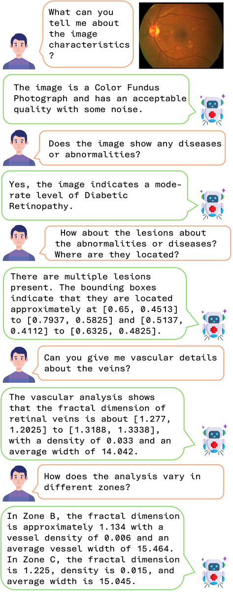
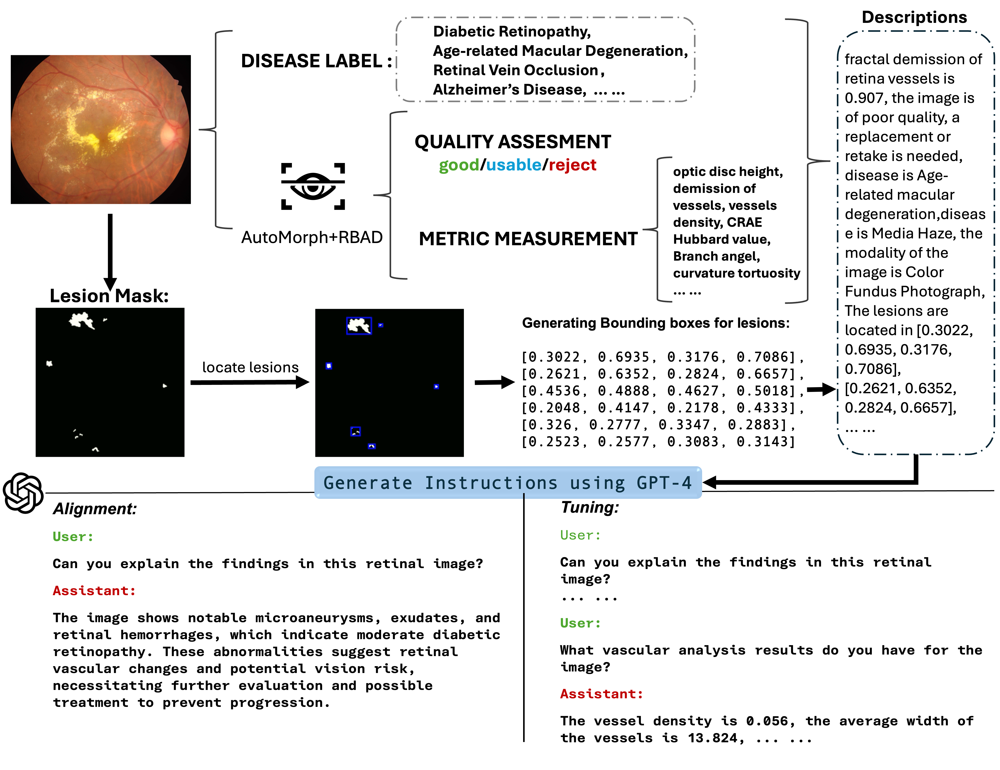

# RetinalGPT

[](https://github.com/Retinal-Research/RetinalGPT)
[](https://arxiv.org/abs/2503.03987)
[](https://huggingface.co/ASU-GSL/RetinalGPT)

RetinalGPT is a retinal multimodal assistant built on large vision-language models for clinically oriented retinal image understanding and conversation.

This repository provides the core code used in the paper [RetinalGPT: A Retinal Clinical Preference Conversational Assistant Powered by Large Vision-Language Models](https://arxiv.org/abs/2503.03987), including:

- inference scripts for the released RetinalGPT model
- the retinal instruction and alignment data construction pipeline
- dataset-specific retinal description builders
- a minimal sample for adapting the pipeline to custom retinal data

This repository is primarily a research and data-construction codebase. It is not the full end-to-end training stack for every component of the project.

<p align="center">
  
</p>

## Highlights

- Retinal-domain multimodal assistant: supports retinal image reasoning through a LLaVA-style vision-language backbone.
- Structured data construction pipeline: converts heterogeneous retinal metadata into unified hidden descriptions for conversation generation.
- Two supervision targets: supports both `instruction` data and compact `alignment` data.
- Two execution paths: supports direct generation and batch request packaging / unpacking workflows.
- Bring-your-own-data support: includes a minimal sample for adapting the pipeline to new retinal datasets.

## What Is In This Repo

There are two main ways to use this repository:

1. Run the released RetinalGPT model for retinal image inference.
2. Build retinal conversation data for instruction tuning or alignment experiments.

If you only want model inference, start with `run_retinalGPT_simple.py` or `run_retinalGPT.py`.

If you want to build new retinal conversations from metadata and images, start with `Instruction/pipeline_runner.py`, `Instruction/batch_runner.py`, and `Instruction/sample/`.

## Installation

The environment follows the LLaVA-style base setup used in the project, with extra dependencies from this repository:

```bash
conda create -n retinalgpt python=3.10 -y
conda activate retinalgpt
pip install --upgrade pip
pip install -r requirements.txt
```

Notes:

- CUDA is required for the provided inference scripts.
- If you already have a working LLaVA or `llava-v0` style environment, you can usually reuse it.

## Quick Start

### 1. Single-image inference

Use the simplest entrypoint when you want one retinal image and one question:

```bash
python3 run_retinalGPT_simple.py \
  --model-name ASU-GSL/RetinalGPT \
  --image-file /path/to/retinal_image.png \
  --question "Please describe this retinal image in detail."
```

### 2. Batch inference

Use the batch script when you want to process a folder of images with a JSON or JSONL question file:

```bash
python3 run_retinalGPT.py \
  --model-name ASU-GSL/RetinalGPT \
  --image-folder /path/to/images \
  --question-file /path/to/questions.jsonl \
  --answers-file /path/to/predictions.jsonl
```

A minimal example question file is available at [examples/inference/questions.json](./examples/inference/questions.json).

Supported input fields include:

- `id`
- `image` or `images`
- `question`
- `questions`
- `messages`

When `messages` is provided, the script automatically extracts user or human turns as questions.

### 3. Run an instruction or alignment job

```bash
cd Instruction
python3 pipeline_runner.py UK_instruction_direct
```

### 4. Run a batch packaging job

```bash
cd Instruction
python3 batch_runner.py APTOS
```

### 5. Run the custom-data sample

```bash
cd Instruction
python3 sample/generate_instruction_conversations.py \
  --metadata-csv sample/metadata_template.csv \
  --image-dir /path/to/your/images \
  --output-jsonl sample/generated_instruction_conversations.jsonl
```

For a minimal walkthrough, see [Instruction/sample/README.md](./Instruction/sample/README.md).

## Repository Structure

```text
RetinalGPT/
├── Instruction/
│   ├── Desc/                         # Dataset-specific retinal description builders
│   ├── configs/                      # Config-driven pipeline and batch jobs
│   ├── experiments/                  # Older script-style entrypoints
│   ├── sample/                       # Minimal custom-data example
│   ├── tools/                        # Utility helpers for boxes and postprocessing
│   ├── batch_runner.py               # Batch request packaging / unpacking
│   ├── pipeline_runner.py            # Instruction / alignment generation runner
│   ├── instruction_gen_async.py      # Async API-based generation
│   ├── convert2json.py               # Output parsing and JSON conversion
│   └── ...
├── figures/                          # Figures used in the paper / README
├── llava/                            # LLaVA-based modeling components
├── run_retinalGPT.py                 # Batch inference entrypoint
├── run_retinalGPT_simple.py          # Single-image inference entrypoint
├── requirements.txt
└── README.md
```

## Data Construction Pipeline

The main idea of the data pipeline is to convert retinal metadata into a unified hidden textual description, then pair that description with prompt instructions to generate conversational supervision.

Typical metadata sources include:

- image quality predictions
- vascular or fractal quantitative features
- disease labels
- lesion masks or bounding boxes
- dataset-specific annotations

Each dataset is wrapped by a description class under `Instruction/Desc`, such as:

- `APTOSDesc`
- `EyeQDesc`
- `IDRIDDesc`
- `MICCAIDesc`
- `MessidorDesc`
- `ODIRDDesc`
- `RFMiDDesc`
- `UKDesc`

These classes share the same goal: map heterogeneous retinal annotations into reusable natural-language descriptions that can be consumed by a multimodal model.

<p align="center">
  
</p>

## Main Pipeline Modes

The repository supports two data targets:

- `instruction`: multi-turn retinal conversations
- `alignment`: compact alignment-style supervision, usually single-turn

It also supports two execution modes:

- `direct`: call the API directly and write outputs locally
- `batch`: package local requests, send them to an API workflow, then unpack returned outputs

In practice, the typical engineering flow is:

1. Build hidden metadata with a class in `Instruction/Desc/`.
2. Choose a job from `Instruction/configs/pipeline_jobs.json` or `Instruction/configs/batch_jobs.json`.
3. Run `pipeline_runner.py` for `instruction` or `alignment`, or `batch_runner.py` for batch workflows.
4. Use `convert2json.py`, `utils.py`, and `Instruction/tools/` for postprocessing and format conversion.
5. Start from `Instruction/sample/` if you want to adapt the pipeline to your own dataset.

## Output Format

The pipeline writes conversation data as JSONL records with fields such as:

- `id`
- `image`
- `conversations`

The inference script writes JSONL records with fields such as:

- `id`
- `image`
- `qa_pairs`

These outputs can then be merged, cleaned, converted, or used in downstream instruction-tuning workflows.

## Legacy Experiment Scripts

The repository still includes older experiment-style entry scripts:

```bash
cd Instruction
python3 experiments/instruction/ins_UK.py
python3 experiments/batch/batch_file_APTOS.py
```

For most users, the config-driven runners are the recommended entrypoints.

## Acknowledgement

We thank the LLaVA and LLaVA-Med projects. Parts of the training and evaluation stack are built on top of their open-source vision-language modeling framework.

## Citation

If you find this project useful, please cite:

```bibtex
@article{zhu2025retinalgpt,
  title={Retinalgpt: A retinal clinical preference conversational assistant powered by large vision-language models},
  author={Zhu, Wenhui and Li, Xin and Chen, Xiwen and Qiu, Peijie and Vasa, Vamsi Krishna and Dong, Xuanzhao and Chen, Yanxi and Lepore, Natasha and Dumitrascu, Oana and Su, Yi and others},
  journal={arXiv preprint arXiv:2503.03987},
  year={2025}
}
```
